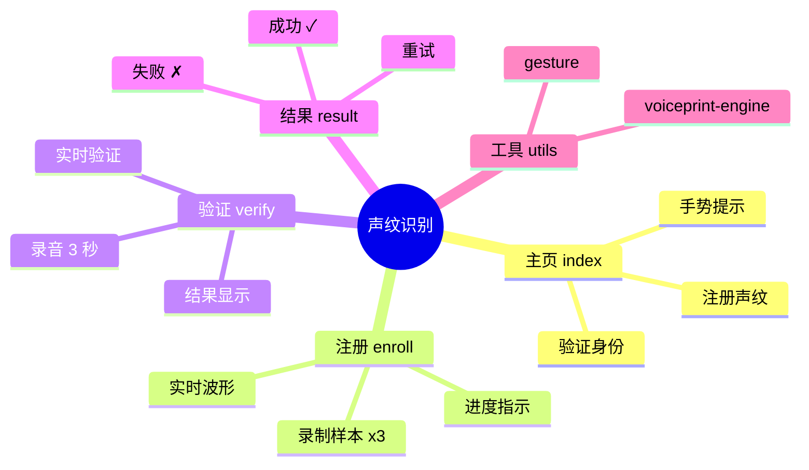
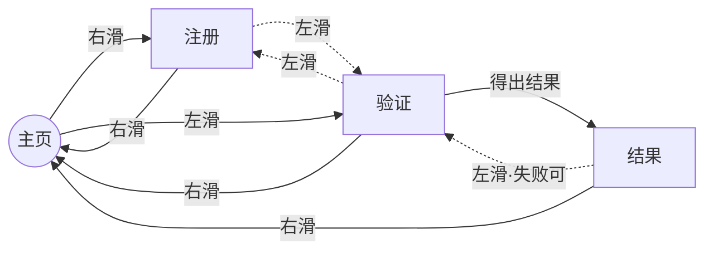

# 声纹识别

用于说话人识别和验证的 AIUI 应用程序，采用声纹生物特征技术。

## 快速开始

1. 安装依赖
2. 启动开发服务器

## 功能特性

- 支持多样本录音的声纹注册
- 基于声学特征匹配的说话人验证
- AI 辅助语音分析

## 权限说明

- microphone（麦克风）
- network（网络）
- audio（音频）
- storage（存储）

祝您使用愉快！

## 可用技能

以下技能为特定任务提供专门指导。当任务与技能描述匹配时，请先激活该技能以加载完整指令。技能指令和支持资源在激活或显式读取文件前保持懒加载状态。

- **aiui-dev** — AIUI 智能体开发技能，包含工程结构、页面规范与 API 参考。

## 应用结构思维导图

### 页面与功能（中心辐射式结构）

### 页面间导航（左右滑动流向，LR 布局）

> 说明：实线为常用主路径，虚线为辅助跳转；「右滑」统一表示返回/前进到主页方向，
> 「左滑」表示进入相邻功能页，符合直觉且保持左右手势对称。

