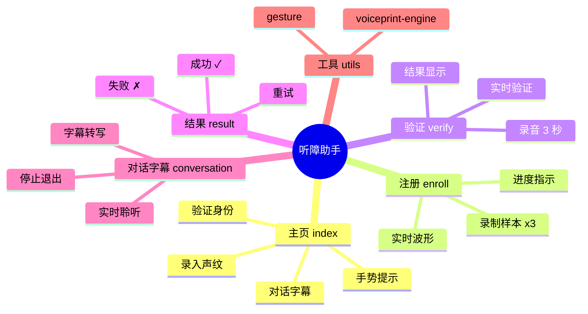
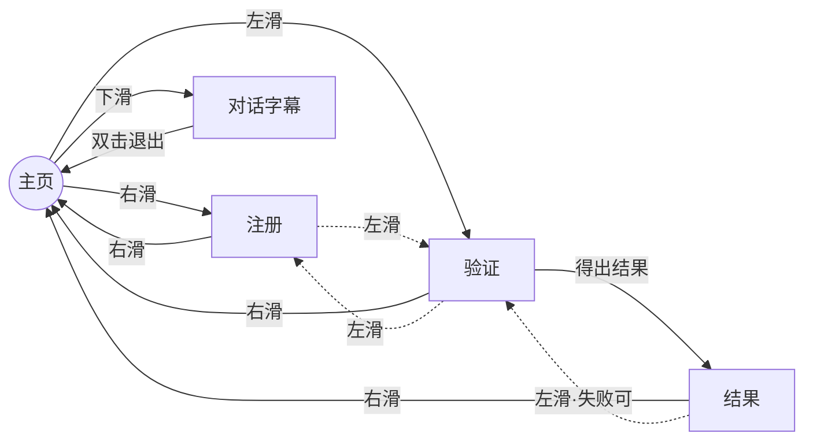

# 听障助手

基于 **Rokid AIUI** 的智能体（Agent）应用，面向听障人群提供说话人识别与实时对话字幕辅助。

## 简介

「听障助手」是一款运行在 Rokid 智能眼镜（AIUI / JSAR 框架）上的语音交互智能体。它利用声纹生物特征技术识别「谁在说话」，并结合实时字幕，帮助听障用户更清晰地感知对话对象与内容。

- **平台**：Rokid AIUI（JSAR 运行时，`.ink` 页面）
- **形态**：眼镜端智能体，支持镜腿手势与仿真操作
- **定位**：听障辅助 · 说话人识别 · 对话字幕

## 快速开始

1. 安装依赖
2. 启动开发服务器（AIUI 仿真器 / 眼镜真机调试）

## 功能特性

- **声纹注册**：多样本录音录入说话人声纹
- **说话人验证**：基于声学特征匹配，确认当前说话人身份
- **对话字幕**：实时转写对话内容，辅助听障用户阅读
- **AI 辅助语音分析**：结合 AI 能力进行语音理解与呈现

## 交互规范（全应用统一）

| 手势 | 行为 |
| --- | --- |
| 滑动（左右 / 上下） | 选择功能 |
| 短按（镜腿 / 点击） | 进入 · 执行 |
| 双击（镜腿 / 长按） | 退出 |

## 权限说明

- microphone（麦克风）
- network（网络）
- audio（音频）
- storage（存储）

祝您使用愉快！

## 可用技能

以下技能为特定任务提供专门指导。当任务与技能描述匹配时，请先激活该技能以加载完整指令。技能指令和支持资源在激活或显式读取文件前保持懒加载状态。

- **aiui-dev** — AIUI 智能体开发技能，包含工程结构、页面规范与 API 参考。

## 应用结构思维导图

### 页面与功能（中心辐射式结构）

### 页面间导航（左右滑动流向，LR 布局）

> 说明：实线为常用主路径，虚线为辅助跳转；「滑动」统一表示选择功能方向，
> 「短按」进入选中项，「双击」退出当前页，符合全应用统一交互规范。
