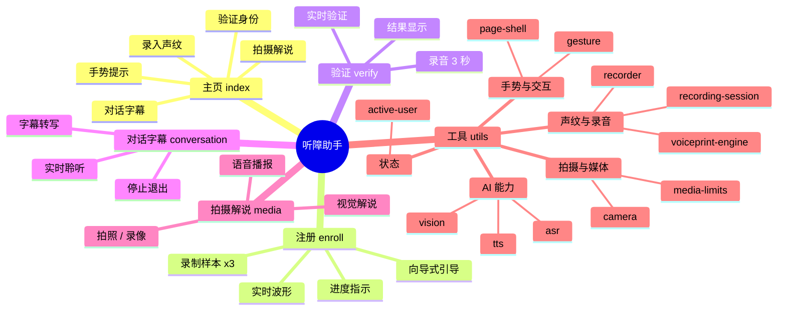
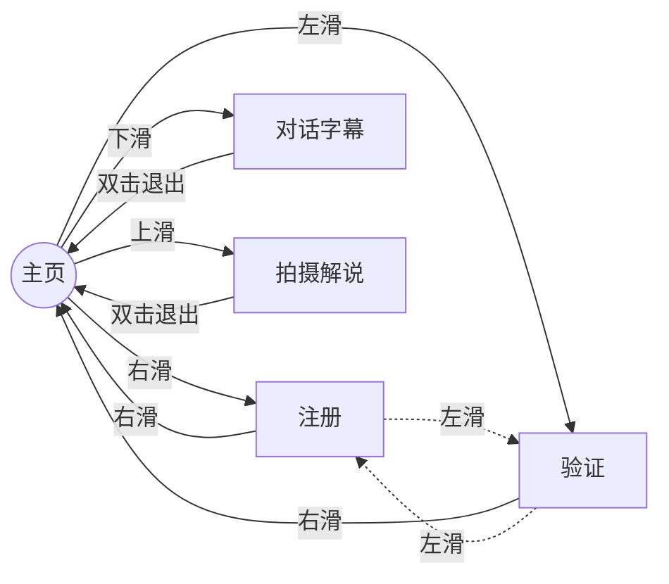

# 听障助手

基于 **Rokid AIUI** 的智能体（Agent）应用，面向听障人群提供说话人识别与实时对话字幕辅助。

## 简介

「听障助手」是一款运行在 Rokid 智能眼镜（AIUI / JSAR 框架）上的语音交互智能体。它利用声纹生物特征技术识别「谁在说话」，并结合实时字幕，帮助听障用户更清晰地感知对话对象与内容。

- **平台**：Rokid AIUI（JSAR 运行时，`.ink` 页面）
- **形态**：眼镜端智能体，支持镜腿手势与仿真操作
- **定位**：听障辅助 · 说话人识别 · 对话字幕

## 快速开始

本项目是纯 Rokid AIUI 工程，**无第三方依赖**（`package.json` 的 dependencies 为空），不需要 `npm install`。

运行方式三选一：

1. **导入包运行**：在 Rokid AIUI Studio 中导入仓库根目录的 `aiui-voiceprint.aix`
2. **打开目录运行**：用 Rokid AIUI Studio 直接打开本项目目录（入口配置为 `app.json`）
3. **真机调试**：Rokid 眼镜连接后真机运行

> 开发者提示：`.aix` 是产物包。**修改 `pages/`、`utils/` 后必须重新打包**，否则导入运行时会缺失新增页面：
> ```bash
> zip -r aiui-voiceprint.aix app.json app.js package.json AGENTS.md README.md pages utils -x '*.DS_Store' '*.aix'
> ```

## 功能介绍

「听障助手」帮听障用户在面对面交流时**看清「谁在说」「说了什么」**。四个功能，按顺序使用效果最佳：

### 1. 录入声纹（首次必做）
把常接触的人的声音记下来。
- 操作：主页选「录入声纹」→ 短按进入 → 按屏幕提示**朗读** → 录满 **3 句以上** → 完成注册
- 建议：为家人、同事、常交流的人各录一次，之后才能识别他们

### 2. 验证身份
确认「现在说话的是谁」。
- 操作：主页选「验证身份」→ 短按进入 → **说一句话** → 系统给出最匹配的身份与相似度
- 前提：需先完成「录入声纹」

### 3. 对话字幕（核心功能）
把对方的话变成**带说话人姓名的字幕**，实时显示在眼镜屏幕上。
- 操作：主页选「对话字幕」→ 短按进入 → **双击**开始/暂停聆听
- 字幕格式：`说话人：内容`（已录入的人显示姓名，未录入显示「陌生人N」）
- 陌生人可**短按**为其现场起名，之后自动识别为这个名字
- 说明：说话人识别为**真实声纹**；文字由 Rokid 语音识别提供（未配置时显示演示文本）

### 4. 拍摄解说
拍下眼前画面，由 AI 生成解说并语音播报。
- 操作：主页选「拍摄解说」→ 短按进入 → 拍照/录像 → 生成解说
- 需配置视觉 API Key（见下节），未配置时为演示模式

### 上手建议
1. 第一次使用：先做「录入声纹」，至少录 1 个人
2. 日常交流：用「对话字幕」，字幕会自动标出说话人
3. 想确认身份：用「验证身份」
4. 看不清眼前事物：用「拍摄解说」

## 拍摄解说配置（重要）

AIUI 内置 AI 只提供**纯文本**大模型能力（`session.prompt()`），**没有视觉 / 多模态接口**；
因此「解说图片或视频」是通过 `wx.request` 调用外部多模态网关（默认智谱 GLM-4V）实现的。

- **未配置 API Key 时**：自动进入**演示模式**，返回的解说是演示文本，页面徽标显示「演示」，**这不是真实识别结果**。
- **启用真实解说**：
  1. 进入「拍摄解说」页，点右上角模式徽标打开**视觉设置**
  2. 粘贴[智谱开放平台](https://open.bigmodel.cn/dev/api)的 API Key（模型 `glm-4v-plus`，同时支持图片与视频关键帧）
  3. 点「保存密钥」，徽标变为「真实」，之后即为联网真实解说

密钥仅存于本地 storage（`vision_config`），**不硬编码进源码**；点「清除」即回到演示模式。

## 交互规范（全应用统一）

| 手势 | 行为 |
| --- | --- |
| 滑动（左右 / 上下） | 选择功能 |
| 短按（镜腿 / 点击） | 进入 · 执行 |
| 双击（镜腿 / 长按） | 退出 |

### 各页面手势的具体含义

| 页面 | 短按 | 双击 | 滑动 |
| --- | --- | --- | --- |
| 主页 index | 进入高亮选中的功能 | 退出应用 | 上/左：上移高亮；下/右：下移高亮 |
| 注册 enroll | 开始向导 → 确认启用 → 推进流程（录音中停止 / 待存保存 / 满 3 句完成 / 否则开始录音） | 向导中**只暂停回起点**（防误触闪退）；询问启用时选「不启用」；否则退出 | 向导进行中不跳页；其余：左/上 → 跳验证页，右/下 → 取消注册 |
| 验证 verify | 开始验证；已有结果时重试 | 返回主页 | 左/上 → 跳注册页；右/下 → 返回主页 |
| 对话字幕 conversation | 给最近一位陌生人起名 | 停止聆听并退出 | 左/上 → 清空字幕；右/下 → 开始 / 暂停聆听 |
| 拍摄解说 media | 开始拍摄 → 拍照 / 开始停止录像 | 已够 3 项则开始解说；否则退出 | 拍摄中：切换 拍照 ↔ 录像 |

## 权限说明

- microphone（麦克风）
- network（网络）
- audio（音频）
- storage（存储）
- camera（相机）

## 数据存储

所有数据均存于设备本地 storage，**不上传服务器**：

| 键 | 内容 |
| --- | --- |
| `voiceprint_db` | 已注册声纹用户（`users[]`：`id` / `name` / `enrolledAt` / `template` 声纹模板） |
| `conversation_history` | 对话字幕历史（最近 50 条：`speaker` / `text` / `isKnown` / `ts`），供「字幕回看」跨会话查询 |
| `vision_config` | 拍摄解说的视觉网关配置（`baseUrl` / `apiKey` / `model`） |

清理方式：主页「清空全部用户」清空声纹库；对话页「字幕回看 → 清空」删除历史字幕；拍摄解说页「清除」删除密钥并回到演示模式。

## 声纹库备份与迁移（换镜免重录）

主页底部提供声纹库导入/导出，基于剪贴板 JSON，无需网络与文件权限：

- **导出**：主页「导出声纹库」→ 声纹 JSON 复制到剪贴板，可粘贴到备忘录/聊天工具中转。
- **导入**：在新设备上复制 JSON → 主页「导入声纹库」→ 按 `id` 去重合并（同 id 覆盖为新数据）。
- **重命名**：用户列表「改名」按钮，直接修改已录入声纹的姓名。

## 字幕历史回看

对话字幕页新增「字幕回看（最近 50 条）」入口：暂停聆听并展示历史字幕（时间 + 说话人 + 内容，最新在上）；起名入库会同步回改历史中的陌生人标签。回看模式下屏蔽手势防误触，短按或「关闭」退出。

祝您使用愉快！

## 可用技能

以下技能为特定任务提供专门指导。当任务与技能描述匹配时，请先激活该技能以加载完整指令。技能指令和支持资源在激活或显式读取文件前保持懒加载状态。

- **aiui-dev** — AIUI 智能体开发技能，包含工程结构、页面规范与 API 参考。

## 应用结构思维导图

### 页面与功能（中心辐射式结构）


```mermaid
mindmap
  root((听障助手))
    主页 index
      录入声纹
      验证身份
      对话字幕
      拍摄解说
      手势提示
    注册 enroll
      向导式引导
      录制样本 x3
      实时波形
      进度指示
    验证 verify
      录音 3 秒
      实时验证
      结果显示
    对话字幕 conversation
      实时聆听
      字幕转写
      停止退出
    拍摄解说 media
      拍照 / 录像
      视觉解说
      语音播报
    工具 utils
      声纹与录音
        voiceprint-engine
        recorder
        recording-session
      手势与交互
        gesture
        page-shell
      AI 能力
        asr
        tts
        vision
      拍摄与媒体
        camera
        media-limits
      状态
        active-user
```

### 页面间导航（左右滑动流向，LR 布局）


```mermaid
flowchart LR
  Home((主页)) -->|右滑| Enroll[注册]
  Home -->|左滑| Verify[验证]
  Home -->|下滑| Conversation[对话字幕]
  Home -->|上滑| Media[拍摄解说]
  Enroll -->|右滑| Home
  Verify -->|右滑| Home
  Media -->|双击退出| Home
  Enroll -.->|左滑| Verify
  Verify -.->|左滑| Enroll
  Conversation -->|双击退出| Home
```

> 说明：实线为常用主路径，虚线为辅助跳转；「滑动」统一表示选择功能方向，
> 「短按」进入选中项，「双击」退出当前页，符合全应用统一交互规范。
