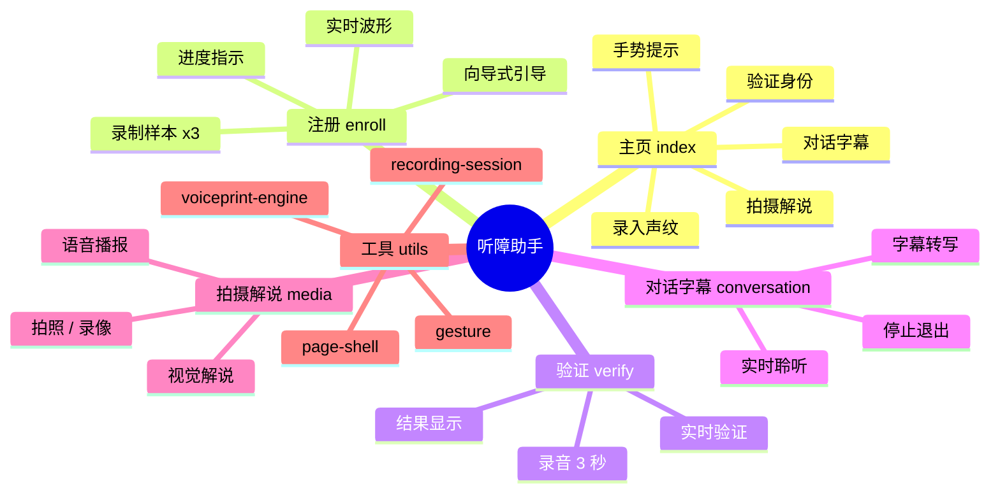
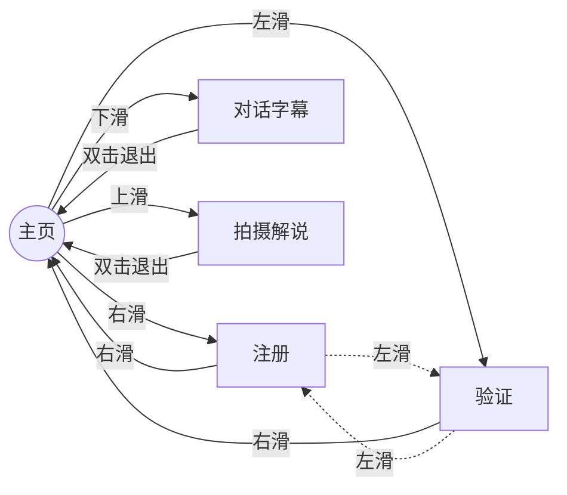

# 听障助手

基于 **Rokid AIUI** 的智能体（Agent）应用，面向听障人群提供说话人识别与实时对话字幕辅助。

## 简介

「听障助手」是一款运行在 Rokid 智能眼镜（AIUI / JSAR 框架）上的语音交互智能体。它利用声纹生物特征技术识别「谁在说话」，并结合实时字幕，帮助听障用户更清晰地感知对话对象与内容。

- **平台**：Rokid AIUI（JSAR 运行时，`.ink` 页面）
- **形态**：眼镜端智能体，支持镜腿手势与仿真操作
- **定位**：听障辅助 · 说话人识别 · 对话字幕

## 快速开始

本项目是纯 Rokid AIUI 工程，**无第三方依赖**（`package.json` 的 dependencies 为空），不需要 `npm install`。

运行方式三选一：

1. **导入包运行**：在 Rokid AIUI Studio 中导入仓库根目录的 `aiui-voiceprint.aix`
2. **打开目录运行**：用 Rokid AIUI Studio 直接打开本项目目录（入口配置为 `app.json`）
3. **真机调试**：Rokid 眼镜连接后真机运行

> 开发者提示：`.aix` 是产物包。**修改 `pages/`、`utils/` 后必须重新打包**，否则导入运行时会缺失新增页面：
> ```bash
> zip -r aiui-voiceprint.aix app.json app.js package.json AGENTS.md README.md pages utils -x '*.DS_Store' '*.aix'
> ```

## 功能特性

- **声纹注册**：向导式录入 3 句样本，自动生成说话人声纹
- **说话人验证**：基于声学特征匹配，确认当前说话人身份
- **对话字幕**：实时转写对话内容，标注说话人，辅助听障用户阅读
- **眼镜拍摄解说**：拍摄图片 / 录像后由视觉模型生成解说并语音播报（需配置 API Key，见下节）
- **AI 辅助语音分析**：结合 AI 能力进行语音理解与呈现

## 拍摄解说配置（重要）

AIUI 内置 AI 只提供**纯文本**大模型能力（`session.prompt()`），**没有视觉 / 多模态接口**；
因此「解说图片或视频」是通过 `wx.request` 调用外部多模态网关（默认智谱 GLM-4V）实现的。

- **未配置 API Key 时**：自动进入**演示模式**，返回的解说是演示文本，页面徽标显示「演示」，**这不是真实识别结果**。
- **启用真实解说**：
  1. 进入「拍摄解说」页，点右上角模式徽标打开**视觉设置**
  2. 粘贴[智谱开放平台](https://open.bigmodel.cn/dev/api)的 API Key（模型 `glm-4v-plus`，同时支持图片与视频关键帧）
  3. 点「保存密钥」，徽标变为「真实」，之后即为联网真实解说

密钥仅存于本地 storage（`vision_config`），**不硬编码进源码**；点「清除」即回到演示模式。

## 交互规范（全应用统一）

| 手势 | 行为 |
| --- | --- |
| 滑动（左右 / 上下） | 选择功能 |
| 短按（镜腿 / 点击） | 进入 · 执行 |
| 双击（镜腿 / 长按） | 退出 |

## 权限说明

- microphone（麦克风）
- network（网络）
- audio（音频）
- storage（存储）
- camera（相机）

## 数据存储

所有数据均存于设备本地 storage，**不上传服务器**：

| 键 | 内容 |
| --- | --- |
| `voiceprint_db` | 已注册声纹用户（`users[]`：`id` / `name` / `enrolledAt` / `template` 声纹模板） |
| `vision_config` | 拍摄解说的视觉网关配置（`baseUrl` / `apiKey` / `model`） |

清理方式：主页「清空全部用户」清空声纹库；拍摄解说页「清除」删除密钥并回到演示模式。

祝您使用愉快！

## 可用技能

以下技能为特定任务提供专门指导。当任务与技能描述匹配时，请先激活该技能以加载完整指令。技能指令和支持资源在激活或显式读取文件前保持懒加载状态。

- **aiui-dev** — AIUI 智能体开发技能，包含工程结构、页面规范与 API 参考。

## 应用结构思维导图

### 页面与功能（中心辐射式结构）


```mermaid
mindmap
  root((听障助手))
    主页 index
      录入声纹
      验证身份
      对话字幕
      拍摄解说
      手势提示
    注册 enroll
      向导式引导
      录制样本 x3
      实时波形
      进度指示
    验证 verify
      录音 3 秒
      实时验证
      结果显示
    对话字幕 conversation
      实时聆听
      字幕转写
      停止退出
    拍摄解说 media
      拍照 / 录像
      视觉解说
      语音播报
    工具 utils
      voiceprint-engine
      gesture
      page-shell
      recording-session
```

### 页面间导航（左右滑动流向，LR 布局）


```mermaid
flowchart LR
  Home((主页)) -->|右滑| Enroll[注册]
  Home -->|左滑| Verify[验证]
  Home -->|下滑| Conversation[对话字幕]
  Home -->|上滑| Media[拍摄解说]
  Enroll -->|右滑| Home
  Verify -->|右滑| Home
  Media -->|双击退出| Home
  Enroll -.->|左滑| Verify
  Verify -.->|左滑| Enroll
  Conversation -->|双击退出| Home
```

> 说明：实线为常用主路径，虚线为辅助跳转；「滑动」统一表示选择功能方向，
> 「短按」进入选中项，「双击」退出当前页，符合全应用统一交互规范。
