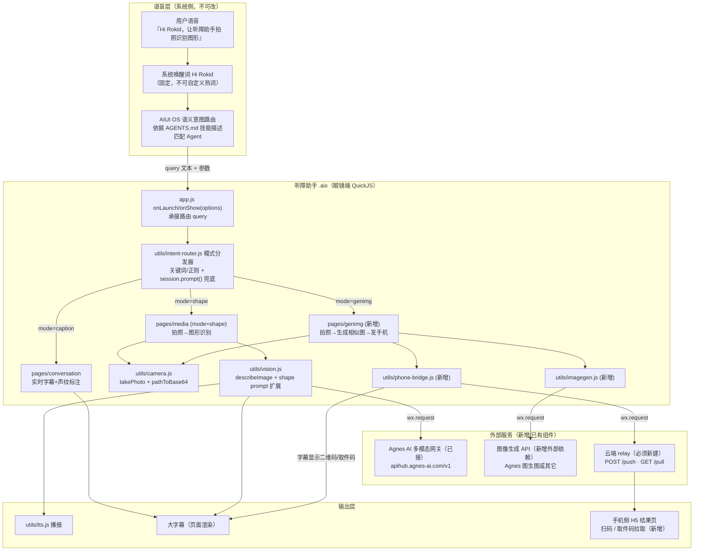
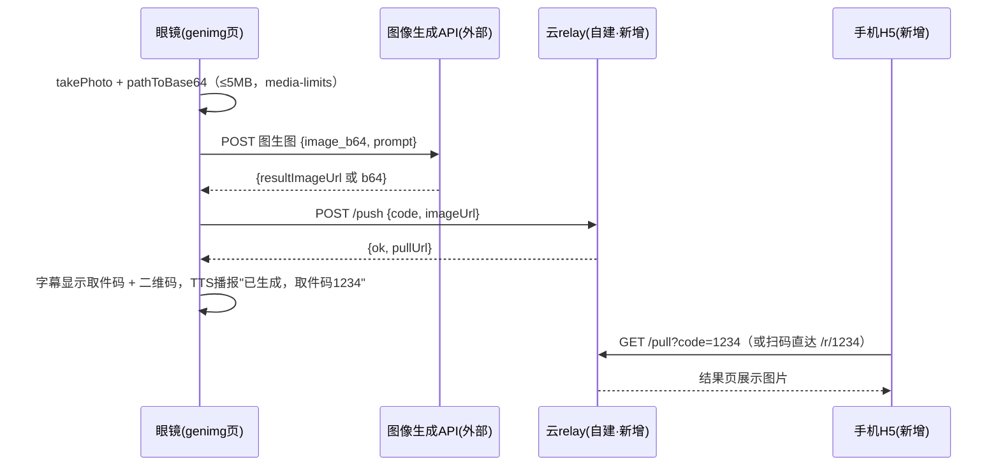

# 听障助手 × Hi Rokid 语音直呼集成方案

> 目标：让用户对眼镜说「Hi Rokid，打开听障助手 / 让听障助手拍照识别图形 / 拍张照生成相似的图发到手机」，即可唤起本 `.aix` 应用并直达对应模式。
> 前提共识：**Rokid 不开放自定义热词**，本方案的"热唤醒"= 系统唤醒词「Hi Rokid」+ AIUI OS 智能体商店语义路由 + 应用内 `onLaunch(options)` 参数分发，三层拼出来的等效体验。

---

## 1. 总架构图



---

## 2. 热唤醒与意图路由层

### 2.1 真相先说清

| 想要的 | 平台现实 | 本方案的等效实现 |
|---|---|---|
| 自定义热词「听障助手」直接唤醒 | **做不到**。唤醒词固定为「Hi Rokid」（或长按触控板），第三方无法注册热词 | 「Hi Rokid」唤醒系统 → 用户在同一句/下一句里说出含「听障助手」的指令 → AIUI OS 按 AGENTS.md 的技能描述做**语义匹配**唤起本 Agent |
| app.json 声明 voice intent | app.json 只有 `pages` + `window` + `permissions`，无 intent/skill 字段 | 意图声明全部落在 **AGENTS.md**（OS/LLM 路由依据）；运行时参数走 `onLaunch(options)` / `onShow(options)` |

结论：路由质量 = AGENTS.md 写得好不好 + 应用内兜底解析强不强。两头都要做，**不依赖 OS 精确传参**（OS 能不能把"模式"作为结构化参数传进来是未决项，见 §8，因此应用内必须能从原始 query 文本自行解析）。

### 2.2 AGENTS.md 改造（三技能声明示例）

现有 AGENTS.md 是英文脚手架残留，路由匹配价值≈0，需整体重写。示例：

```markdown
# 听障助手（Hearing Assist Agent）

## 身份
面向听障用户的 Rokid 眼镜辅助 Agent：把周围的声音变成文字、把眼前的画面变成语音和大字幕。

## System Prompt
你是听障助手。用户可能听不见或听不清，所有反馈必须同时给出大字幕与（可用时的）语音播报。
收到用户指令后，判断属于下列哪个技能并唤起对应模式；无法判断时打开主页。

## Capabilities（技能清单 — 路由匹配依据）

### 技能 1：实时对话字幕（caption）
- 触发说法：打开听障助手 / 开始字幕 / 帮我看看别人在说什么 / 实时字幕 / 对话转文字
- 行为：进入实时对话字幕模式，转写周围人声并用声纹标注说话人。
- 唤起参数：mode=caption

### 技能 2：拍照识别图形（shape）
- 触发说法：拍照识别图形 / 看看这是什么形状 / 拍照并告诉我图上的详细信息 /
  识别眼前的图 / 这个图形是什么
- 行为：拍摄一张照片，识别其中的图形、形状、文字与结构，给出详细信息，
  以语音播报 + 大字幕呈现。
- 唤起参数：mode=shape

### 技能 3：拍照生成相似图并发到手机（genimg）
- 触发说法：拍张照生成相似的模型 / 照着这个生成一张图发到手机 /
  拍照生成类似的图 / 生成相似模型发我手机
- 行为：拍照 → 调用图像生成服务生成相似图 → 生成取件码/二维码，
  用户用手机扫码或输码查看结果。
- 唤起参数：mode=genimg

## 约束
- 端上无多模态视觉与图像生成能力，均通过外部服务完成；网络不可用时降级为演示说明。
- 所有面向用户的输出必须有大字幕。
```

要点：**触发说法要穷举用户口语变体**（路由是 LLM 语义匹配，例句就是它的 few-shot）；每个技能末尾写死 `唤起参数：mode=xxx`，即使 OS 不传结构化参数，也给 OS 一个"往 query 里带 mode"的提示，两头下注。

### 2.3 app.js 的 onLaunch/onShow 分发（伪代码）

```javascript
// app.js
import { routeIntent } from './utils/intent-router.js'

export default {
  onLaunch(options) {
    this._dispatch(options, /*isLaunch*/ true)
  },
  onShow(options) {
    // 热启动：应用已在后台，用户再次语音唤起时走 onShow
    if (options && (options.query || options.mode)) this._dispatch(options, false)
  },

  _dispatch(options, isLaunch) {
    // 字段名容错：官方文档未明确 query 载荷键名（见 §8 未决项），全部候选都摸一遍
    var raw = ''
    var opt = options || {}
    var q = opt.query || {}
    if (typeof q === 'string') raw = q
    else raw = q.query || q.text || q.utterance || q.asr || opt.text || ''
    var explicitMode = q.mode || opt.mode || ''   // OS 若真能传结构化 mode，最高优先

    var route = explicitMode
      ? { mode: explicitMode, page: MODE_PAGE[explicitMode], params: {} }
      : routeIntent(raw)                          // 从原始文本解析（主路径）

    this.globalData.launchIntent = { raw: raw, route: route, at: Date.now() }

    if (!route || route.mode === 'home') return   // 冷启动默认落 index，不跳转
    var url = route.page + '?mode=' + route.mode +
              '&autoStart=1&q=' + encodeURIComponent(raw)
    if (isLaunch) {
      // onLaunch 时页面栈可能未就绪，延迟一拍再跳
      setTimeout(function () { wx.redirectTo({ url: url }) }, 0)
    } else {
      wx.redirectTo({ url: url })
    }
  },
  globalData: { /* ...现有字段...，新增 launchIntent: null */ }
}
```

页面侧：`pages/media/media` 的 `onLoad(query)` 读 `query.mode==='shape' && query.autoStart==='1'` 时直接触发拍照流程（跳过手动按钮）；同时兜底读 `getApp().globalData.launchIntent`（防 redirectTo 传参在个别固件上丢失）。

---

## 3. 模式分发器：utils/intent-router.js

职责：`原始 query 文本 → {mode, page, params, confidence}`。两级：正则秒判（0 成本、离线可用）→ `session.prompt()` 轻量分类兜底（端上纯文本 LLM，可用时才走）。

```javascript
// utils/intent-router.js
export var MODE_PAGE = {
  caption: '/pages/conversation/conversation',
  shape:   '/pages/media/media',
  genimg:  '/pages/genimg/genimg',
  home:    '/pages/index/index'
}

// 一级：关键词/正则路由表（命中即返回，顺序 = 优先级：更具体的在前）
var RULES = [
  { mode: 'genimg', re: /(生成|画).{0,8}(相似|类似|模型|一张图)|发(到|给).{0,4}(手机|电话)/ },
  { mode: 'shape',  re: /(拍照|拍一?张|看看).{0,10}(识别|是什么|图形|形状|信息)|识别.{0,6}(图形|形状|图案)/ },
  { mode: 'caption',re: /(字幕|转写|说什么|对话|听不清|实时)/ },
  { mode: 'home',   re: /(打开|启动|进入)?听障助手$/ }
]

export function routeIntent(raw) {
  var text = (raw || '').trim()
  if (!text) return { mode: 'home', page: MODE_PAGE.home, params: {}, confidence: 1 }

  for (var i = 0; i < RULES.length; i++) {
    if (RULES[i].re.test(text)) {
      return { mode: RULES[i].mode, page: MODE_PAGE[RULES[i].mode],
               params: { q: text }, confidence: 0.9 }
    }
  }
  return { mode: 'home', page: MODE_PAGE.home, params: { q: text }, confidence: 0.3 }
}

// 二级兜底：端上 LLM 分类（异步，只在一级置信度低时调用；失败静默落 home）
export function routeIntentSmart(raw, cb) {
  var quick = routeIntent(raw)
  if (quick.confidence >= 0.9 || typeof session === 'undefined' || !session.prompt) {
    return cb(quick)
  }
  var p = '将指令分类为其中一个词并只输出该词：caption/shape/genimg/home。指令：' + raw
  session.prompt(p).then(function (out) {
    var m = String(out || '').trim().toLowerCase()
    if (MODE_PAGE[m]) cb({ mode: m, page: MODE_PAGE[m], params: { q: raw }, confidence: 0.7 })
    else cb(quick)
  }).catch(function () { cb(quick) })
}
```

设计取舍：
- **正则为主、LLM 为辅**——`session.prompt()` 延迟不可控且能力探测可能失败，正则表可离线秒回；LLM 只救"说法太怪"的长尾。
- 路由表与 AGENTS.md 技能清单**必须同步维护**（同一批触发说法），否则出现"OS 路由进来了、应用内认不出"的割裂。
- `session.prompt` 需与 asr.js 同款"能力探测"包一层（`typeof session !== 'undefined'`），QuickJS 环境不保证注入。

---

## 4. 用例 B：拍照识别图形链

**改动本质：零新文件，vision.js 加一个定制 prompt 的入口 + media 页加 shape 模式分支。** 链路完全复用：`camera.takePhoto → pathToBase64 → vision（新 prompt）→ tts.start + 大字幕`。

### 4.1 vision.js 扩展

现有 `describeImage(dataUrl)` 用通用解说 prompt。新增：

```javascript
// utils/vision.js 新增导出
var SHAPE_PROMPT =
  '你是视觉结构分析助手，服务对象是听障用户，请分析这张照片中的主要图形/物体，' +
  '严格按以下结构输出（没有的项写"无"，不要输出多余寒暄）：\n' +
  '【类别】图形/物体是什么（如：三角形标志、机械零件、流程图、建筑立面）\n' +
  '【形状构成】由哪些基本形状组成（圆/方/三角/多边形/曲线），各自数量与嵌套关系\n' +
  '【尺寸比例】各部分相对大小与比例关系（如：主体占画面约2/3，左圆约为右方形的一半）\n' +
  '【颜色】主要颜色及分布位置\n' +
  '【文字】图上出现的所有文字，逐条列出\n' +
  '【空间关系】各元素的上下左右/包含/相交关系\n' +
  '【可能用途】这个图形/物体最可能是什么、用来做什么（给1-2个推断并说明依据）\n' +
  '语言简洁，总长不超过300字，适合语音播报。'

export function describeShape(dataUrl) {
  return callVisionGateway({ imageDataUrl: dataUrl, prompt: SHAPE_PROMPT })
  // callVisionGateway = 现有 describeImage 的内部实现，仅 prompt 参数化；
  // 保留原有：apiKey 未配置 → 返回演示文案的降级路径
}
```

实现方式：把 describeImage 内部的固定 prompt 抽成参数（内部函数 `callVisionGateway({imageDataUrl, prompt})`），`describeImage` 与 `describeShape` 都是它的薄封装——**不复制请求/降级逻辑**。

### 4.2 media 页分支

`pages/media/media.js` 的 `onLoad(query)`：`mode==='shape'` 时页面标题/按钮文案切为"图形识别"，拍照回调里调 `vision.describeShape` 替代 `describeImage`；`autoStart==='1'` 时 onReady 后直接触发 takePhoto。结果输出复用现有"TTS 播报 + 大字幕"渲染。结构化文本的【】分段直接按行拆开渲染成分节字幕，可读性优于整段。

---

## 5. 用例 C：拍照 → 生成相似图 → 发到手机链

三段拆解，**诚实边界先立**：眼镜端只做"拍照 + 两次 wx.request + 显示取件码"；图像生成和送达手机全靠外部组件。



### 5.1 眼镜端新增 utils/imagegen.js

```javascript
// utils/imagegen.js —— 图生图适配层，模式对齐 vision.js（探测+降级）
// 依赖：wx.request 可用；apiKey 与 vision 共用 storage 键或独立键 imagegen_api_key
export function generateSimilar(dataUrl, opts) {
  // 入参：dataUrl = 拍照 base64；opts = { style: '相似模型图', size: '1024x1024' }
  // 行为：POST 到 OpenAI 兼容图像接口（Agnes 若开放 images/generations|edits 则直连，
  //       否则换任一图生图 API —— 具体供应商是【未决项，见 §8】）
  // 返回：Promise<{ imageUrl }>  —— 优先要求服务端返 URL 而非 b64，
  //       因为 relay 只中转 URL，避免眼镜端二次搬运大体积 b64
  // 降级：未配置 key / 请求失败 → resolve({ imageUrl: '', demo: true, text: '演示：此处应生成相似图' })
}
```

注意：若所选生成 API 只回 base64，**由 relay 落地成 URL**（眼镜端把 b64 POST 给 relay，relay 存文件返回 URL）——这会把 §5.3 的 relay 契约从"只存 URL"升级为"可存图"，实现时二选一定死。

### 5.2 眼镜端新增 utils/phone-bridge.js

```javascript
// utils/phone-bridge.js —— 云relay客户端
var RELAY_BASE = 'https://<你的relay域名>'   // 存 storage，可在 index 页配置

export function makeCode() {           // 4位数字取件码，语音可播报
  return String(Math.floor(1000 + Math.random() * 9000))
}
export function pushResult(code, imageUrl) {
  // wx.request POST RELAY_BASE + '/push'  body: { code, imageUrl, ttlSec: 1800 }
  // 返回 Promise<{ pullUrl: RELAY_BASE + '/r/' + code }>
  // 降级：relay 不可达 → reject，页面字幕提示"发送手机失败，图片地址：..."（至少给出URL口述）
}
export function qrDataUrl(pullUrl) {
  // 端上无二维码库时的降级序：
  // ① 若打包体积允许，内置纯JS qrcode 生成 dataURL 渲染 <image>
  // ② 否则让 relay 代画：<image src="{RELAY_BASE}/qr?code=xxxx">（wx image 可加载网络图则可行）
  // ③ 都不行 → 只显示大号取件码 + TTS 播报数字
}
```

### 5.3 云端 relay 最小接口契约（**必须新建的外部组件 ①**)

任意栈实现（几十行 FastAPI/Express 即可），部署到现有服务器：

```
POST /push
  body: { "code": "1234", "imageUrl": "https://...", "ttlSec": 1800 }
  resp: { "ok": true, "pullUrl": "https://relay.example.com/r/1234" }
  行为: 内存/Redis 存 code→imageUrl，TTL 过期即焚

GET /pull?code=1234
  resp: { "ok": true, "imageUrl": "https://..." } | { "ok": false, "msg": "取件码不存在或已过期" }

GET /r/{code}          # 手机侧最简形态：H5 结果页（**必须新建的外部组件 ②**）
  行为: 服务端渲染一页 HTML，内嵌  + "长按保存"提示
  （即：手机侧不需要 App，扫码/输码打开浏览器即达）

GET /qr?code=1234      # 可选：服务端生成指向 /r/{code} 的二维码 PNG（给眼镜端渲染）
```

安全底线：code 4 位 + 30 分钟 TTL + 单 code 限拉 N 次，防遍历；relay 不存任何用户身份，仅做匿名短时中转。

### 5.4 新增 pages/genimg 页

流程编排页：`onLoad(query)` → autoStart 拍照 → 字幕"生成中…"（生成 API 通常 5–30s，必须有进度提示与超时兜底）→ `imagegen.generateSimilar` → `phone-bridge.pushResult` → 渲染二维码/大号取件码 + TTS「已生成相似图，手机扫码或输入取件码 1 2 3 4 查看」。失败每一段独立降级（见 §7 表）。

---

## 6. 落地改造清单

| # | 文件 | 动作 | 一句话职责 |
|---|---|---|---|
| 1 | `AGENTS.md` | 重写 | 中文身份 + System Prompt + 三技能触发说法清单，OS 路由匹配的唯一依据 |
| 2 | `app.js` | 修改 | onLaunch/onShow 解析 options（多字段名容错）→ 调 intent-router → redirectTo 分发 |
| 3 | `app.json` | 修改 | pages 增 `pages/genimg/genimg` |
| 4 | `utils/intent-router.js` | 新增 | query 文本 → {mode,page,params}；正则表 + session.prompt 兜底 |
| 5 | `utils/vision.js` | 修改 | prompt 参数化，新增 `describeShape`（结构化图形详解 prompt） |
| 6 | `pages/media/media.*` | 修改 | 支持 `mode=shape` + `autoStart=1`：文案切换、自动拍照、走 describeShape |
| 7 | `utils/imagegen.js` | 新增 | 图生图适配层（探测+降级，对齐 vision.js 模式） |
| 8 | `utils/phone-bridge.js` | 新增 | relay 客户端：makeCode / pushResult / qrDataUrl 三级降级 |
| 9 | `pages/genimg/*` | 新增 | 用例 C 编排页：拍照→生成→push→展示二维码/取件码 |
| 10 | 云端 relay 服务 | **新增外部组件** | /push /pull /r/{code} /qr，短时匿名中转（非眼镜端代码） |
| 11 | 手机 H5 结果页 | **新增外部组件** | relay 的 /r/{code} 服务端渲染页，手机零安装 |
| 12 | 图像生成 API 接入 | **新增外部依赖** | 选定并开通图生图供应商（Agnes 或其它，见 §8） |

排期建议依赖序：4→2→1（路由闭环，可先用模拟 query 自测）∥ 5→6（用例 B 独立可交付）→ 10/11（relay 先行）→ 7→8→9→3（用例 C 收尾）。

---

## 7. 平台约束与诚实降级表

| 能力 | 平台现状 | 本方案对策 | 降级/演示行为 |
|---|---|---|---|
| 自定义热词 | **无**。唤醒词固定 Hi Rokid | AGENTS.md 技能声明 + OS 语义路由等效实现 | 路由未命中时用户手动从启动器打开应用 → index 页保留三模式手动入口按钮 |
| app.json 声明语音意图 | 无 intent/skill 字段 | 参数走 onLaunch/onShow options，多字段名容错解析 | options 无有效 query → 落 index 主页，不报错 |
| OS 传结构化模式参数 | **未证实**（§8 未决项） | 不依赖：应用内 intent-router 从原始文本自行解析 | 文本也拿不到 → 主页 + TTS 播报"请说出要做的事或点击按钮" |
| 端上多模态视觉 | 无，`session.prompt()` 仅纯文本 | 视觉走外部 Agnes 网关（既有 vision.js） | apiKey 未配置/断网 → 返回固定演示文案（既有降级保留） |
| 端上图像生成 | 无 | 外部图生图 API（imagegen.js） | 未配置/失败 → 字幕说明"演示模式：此处应生成相似图"，流程不中断可继续演示 relay 段 |
| wx.uploadFile | 无 | 图像一律 pathToBase64 后经 wx.request JSON 上送（受 media-limits 5MB 约束） | 超限 → 拍照前提示、拒发并播报原因 |
| 眼镜→手机直推通道 | **无**应用内通道 | 自建云 relay + 手机 H5 扫码/取件码（方案主线）；CXR-M SDK 手机伴侣 App 为另一条原生 Android 栈，本期**不做**，仅列为远期替代 | relay 不可达 → 字幕口述图片 URL + 大号取件码兜底；仍失败则提示稍后在眼镜端相册/历史查看 |
| 端上二维码渲染 | 无内置库，网络图加载能力待验证 | 三级：内置纯 JS qrcode → relay 代画 /qr → 纯数字取件码 | 最终兜底 = 大字号取件码 + TTS 逐位播报 |

---

## 8. 风险与未决项（需向 Rokid 官方/实机确认）

1. **语义路由粒度**：智能体商店路由能否做到"带参数唤起指定模式"（把 `mode=shape` 结构化传入），还是只能唤起 Agent 并透传原始话语？——本方案按后者（最坏情形）设计，若前者可行则 intent-router 退化为校验层，白赚精度。**验证法**：发一版含重写 AGENTS.md 的测试包，实机说三类指令，log 打印完整 `onLaunch options` JSON。
2. **options.query 真实字段名与结构**：`query` 是 string 还是 object？键名是 `query/text/utterance` 中哪个？onShow 热启动时是否重复携带？——app.js 已做多候选容错，但需实机 log 定死后删冗余分支。
3. **redirectTo 在 onLaunch 时序**：onLaunch 内立即跳页在该 QuickJS 运行时是否稳定（本方案已用 setTimeout(0) + globalData 双保险，需实测是否够）。
4. **路由匹配率与技能描述迭代**：AGENTS.md 触发说法覆盖不足会导致"Hi Rokid 听懂了但没派给我们"；上架后需按真实 miss 语料迭代描述，确认商店更新 AGENTS.md 是否需重新审核、生效周期多长。
5. **图像生成供应商与成本**：Agnes 网关是否开放 OpenAI 兼容的 images 图生图端点未证实；若否需另选供应商。单张生成成本 × 预期调用量、以及生成内容合规责任（用户拍到人脸/敏感物再生成的合规边界）需立项前定。
6. **relay 合规与运维**：中转图片即使短 TTL 也属用户内容存储，需明确隐私声明、部署地域、HTTPS 证书与限流；4 位取件码的防遍历参数（TTL/次数）要压测定值。
7. **wx image 组件加载外网图片**：relay 代画二维码方案依赖端上 `<image>` 能加载 https 网络图，需实机验证；不行则直接走取件码兜底。
8. **`session.prompt()` 可用性与延迟**：端上 LLM 在本机型的注入情况、首 token 延迟——决定二级路由兜底是否值得保留。
